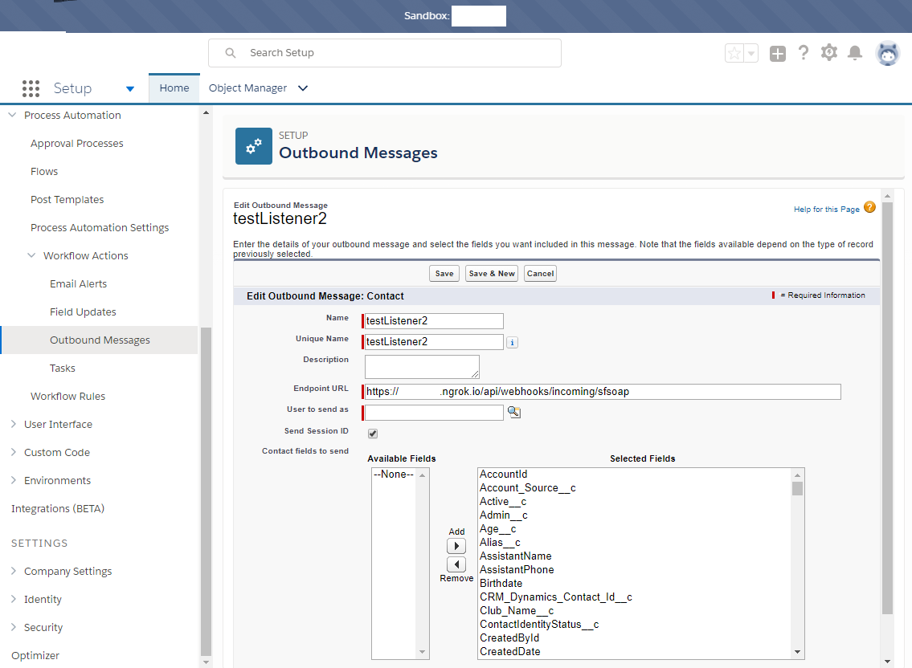
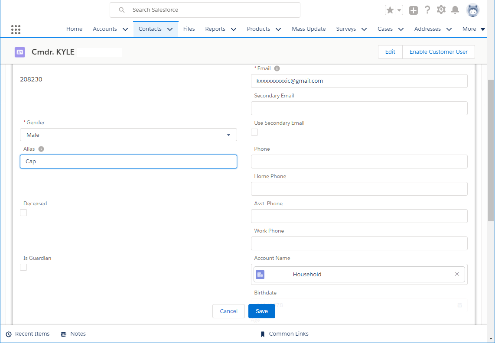
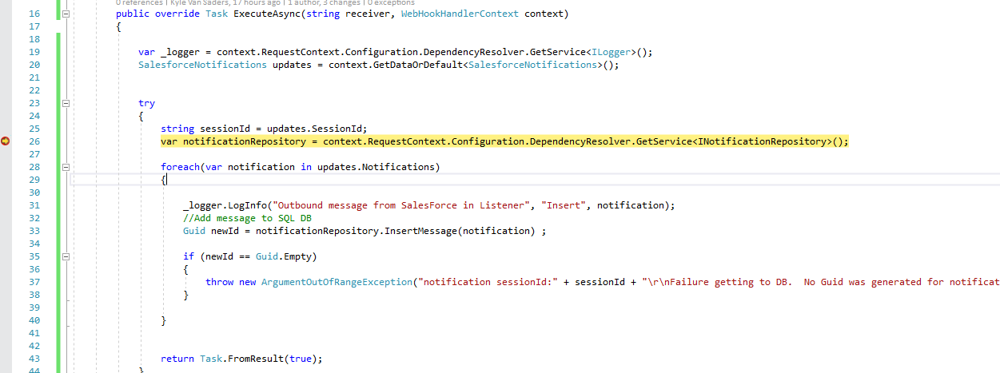
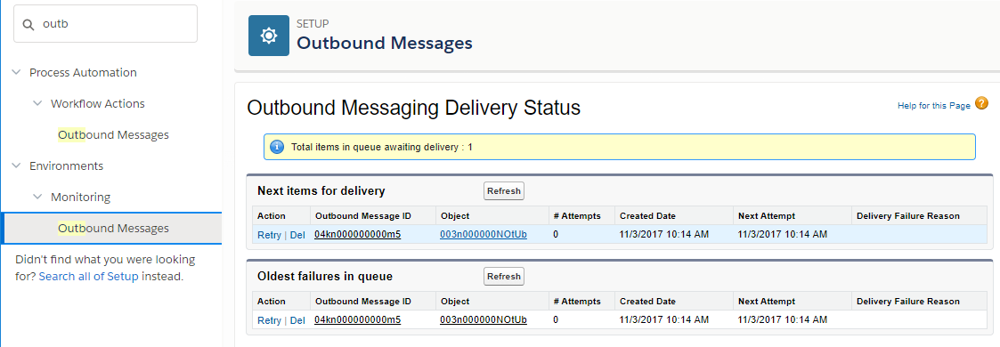
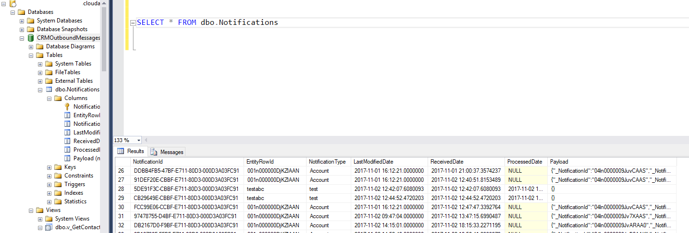
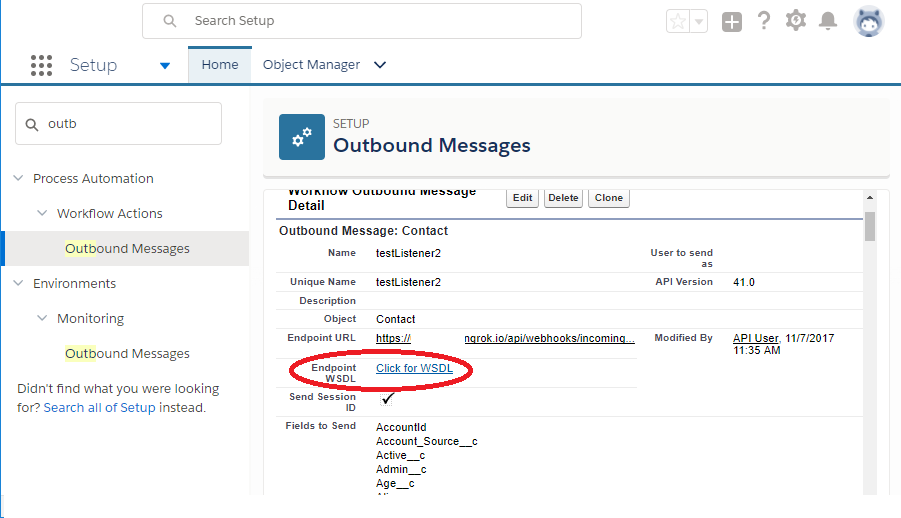
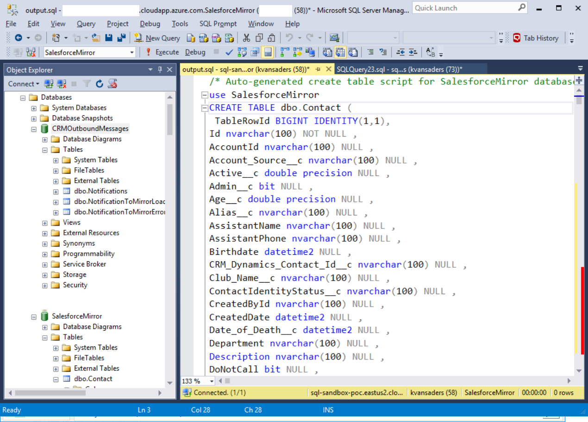
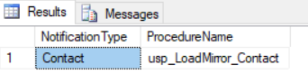

# Salesforce to SQL Outbound Message Listener


## Getting Started
[Prerequisites](#prerequisites)

[how it works - Salesforce Outbound Message + Listener](#how-it-works)

[SQL Stuff - Notifications](#sql-stuff)

[SQL Stuff - Load to Salesforce Mirror DB](#sql-stuff-mirror-db)

[How to implement a new notification type, the easy way](#new-notification-type)


# Prerequisites


- Also, you will need access to a SalesForce environment to send the messages, and your endpoint must be accessible via the internet.   
  [Ngrok extensions in Visual Studio](https://marketplace.visualstudio.com/items?itemName=DavidProthero.NgrokExtensions) is an easy way to expose your localhost development environment to the internet.  Understand though, that the free version creates a new url every session, so the outbound messages will need to be changed each session.  For more stability of url's, either use a paid version of NGrok or deploy the listener to an Azure WebApp and use that url. 

- Optionally you can send mocked salesforce payloads from your favorite tools.
    ```bash
    curl -X POST \
      http://localhost:3993/api/webhooks/incoming/sfsoap \
      -H 'accept-encoding: gzip' \
      -H 'cache-control: no-cache' \
      -H 'content-type: text/xml; charset=utf-8' \
      -H 'postman-token: 83c00e40-c8d6-1290-fac9-8147e8b4e335' \
      -H 'user-agent: Jakarta Commons-HttpClient/3.1' \
      -d '<?xml version="1.0" encoding="UTF-8"?>
    <soapenv:Envelope xmlns:soapenv="http://schemas.xmlsoap.org/soap/envelope/" xmlns:xsd="http://www.w3.org/2001/XMLSchema" xmlns:xsi="http://www.w3.org/2001/XMLSchema-instance">
     <soapenv:Body>
      <notifications xmlns="http://soap.sforce.com/2005/09/outbound">
       <OrganizationId>00Dn00000008y2tEAA</OrganizationId>
       <ActionId>04kn000000000m5AAA</ActionId>
       <SessionId>00Dn00000008y2t!AQ8AQHwogrxFUHYyM3M65BM_mzU63mbZl78iW8nEItuuU.GRQJ6r6.nGSAaNzIfqNWwITcnpLAmzO2L2ZQqlL7VD3wNUGecD</SessionId>
       <EnterpriseUrl>https://mep--GHINDev.cs30.my.salesforce.com/services/Soap/c/41.0/00Dn00000008y2t</EnterpriseUrl>
       <PartnerUrl>https://mep--GHINDev.cs30.my.salesforce.com/services/Soap/u/41.0/00Dn00000008y2t</PartnerUrl>
       <Notification>
        <Id>04ln0000009JvY4AAK</Id>
        <sObject xsi:type="sf:Contact" xmlns:sf="urn:sobject.enterprise.soap.sforce.com">
         <sf:Id>003n000000NOtUbAAL</sf:Id>
         <sf:AccountId>001n000000KABYLAA5</sf:AccountId>
         <sf:Account_Source__c>SF</sf:Account_Source__c>
         <sf:Active__c>1.0</sf:Active__c>
         <sf:Admin__c>false</sf:Admin__c>
         <sf:Age__c>39.0</sf:Age__c>
         <sf:Alias__c>Cap</sf:Alias__c>
         <sf:Birthdate>1978-01-01</sf:Birthdate>
         <sf:CreatedById>00541000000b4LLAAY</sf:CreatedById>
         <sf:CreatedDate>2017-09-01T16:27:19.000Z</sf:CreatedDate>
         <sf:DoNotCall>false</sf:DoNotCall>
         <sf:Email>kxxxxxxxxxic@gmail.com</sf:Email>
         <sf:External_Id__c>G-208230</sf:External_Id__c>
         <sf:FirstName>KYLE</sf:FirstName>
         <sf:GHIN__c>208230</sf:GHIN__c>
         <sf:GW_Volunteers__Unique_Volunteer_Count__c>1.0</sf:GW_Volunteers__Unique_Volunteer_Count__c>
         <sf:GW_Volunteers__Volunteer_Auto_Reminder_Email_Opt_Out__c>false</sf:GW_Volunteers__Volunteer_Auto_Reminder_Email_Opt_Out__c>
         <sf:GW_Volunteers__Volunteer_Hours__c>0.0</sf:GW_Volunteers__Volunteer_Hours__c>
         <sf:Gender__c>Male</sf:Gender__c>
         <sf:Golfer_Id__c>208230.0</sf:Golfer_Id__c>
         <sf:Golfer__c>true</sf:Golfer__c>
         <sf:Handicap_Index_Type__c>18H Handicap Index Only</sf:Handicap_Index_Type__c>
         <sf:HasOptedOutOfEmail>false</sf:HasOptedOutOfEmail>
         <sf:HasOptedOutOfFax>false</sf:HasOptedOutOfFax>
         <sf:Inactive__c>0.0</sf:Inactive__c>
         <sf:IsDeleted>false</sf:IsDeleted>
         <sf:IsEmailBounced>false</sf:IsEmailBounced>
         <sf:Is_Guardian__c>false</sf:Is_Guardian__c>
         <sf:LastModifiedById>005n0000002w77JAAQ</sf:LastModifiedById>
         <sf:LastModifiedDate>2017-11-03T17:24:20.000Z</sf:LastModifiedDate>
         <sf:LastName>JONES</sf:LastName>
         <sf:LastReferencedDate>2017-11-03T17:20:36.000Z</sf:LastReferencedDate>
         <sf:LastViewedDate>2017-11-03T17:20:36.000Z</sf:LastViewedDate>
         <sf:Legacy_GHIN_ID__c>208230</sf:Legacy_GHIN_ID__c>
         <sf:Minor_Contact_to_Gigya__c>false</sf:Minor_Contact_to_Gigya__c>
         <sf:Minor_turned_18__c>false</sf:Minor_turned_18__c>
         <sf:OwnerId>00541000000b4LLAAY</sf:OwnerId>
         <sf:Primary_Email__c>kxxxxxxxxxic@gmail.com</sf:Primary_Email__c>
         <sf:RecordTypeId>012n00000008qVRAAY</sf:RecordTypeId>
         <sf:SRGA_Admin__c>false</sf:SRGA_Admin__c>
         <sf:Salutation>Cmdr.</sf:Salutation>
         <sf:Send_Contact_to_Gigya__c>false</sf:Send_Contact_to_Gigya__c>
         <sf:Suffix__c>Esq.</sf:Suffix__c>
         <sf:SystemModstamp>2017-11-03T17:24:20.000Z</sf:SystemModstamp>
         <sf:Use_Secondary_Email__c>false</sf:Use_Secondary_Email__c>
         <sf:npe01__Lifetime_Giving_History_Amount__c>0.0</sf:npe01__Lifetime_Giving_History_Amount__c>
         <sf:npe01__Organization_Type__c>Household Account</sf:npe01__Organization_Type__c>
         <sf:npe01__PreferredPhone__c>Home</sf:npe01__PreferredPhone__c>
         <sf:npe01__Preferred_Email__c>Personal</sf:npe01__Preferred_Email__c>
         <sf:npe01__Private__c>false</sf:npe01__Private__c>
         <sf:npe01__SystemIsIndividual__c>false</sf:npe01__SystemIsIndividual__c>
         <sf:npe01__Type_of_Account__c>Individual</sf:npe01__Type_of_Account__c>
         <sf:npo02__AverageAmount__c>0.0</sf:npo02__AverageAmount__c>
         <sf:npo02__Best_Gift_Year_Total__c>0.0</sf:npo02__Best_Gift_Year_Total__c>
         <sf:npo02__Formula_HouseholdMailingAddress__c>&lt;br&gt;</sf:npo02__Formula_HouseholdMailingAddress__c>
         <sf:npo02__LargestAmount__c>0.0</sf:npo02__LargestAmount__c>
         <sf:npo02__LastMembershipAmount__c>0.0</sf:npo02__LastMembershipAmount__c>
         <sf:npo02__NumberOfClosedOpps__c>0.0</sf:npo02__NumberOfClosedOpps__c>
         <sf:npo02__NumberOfMembershipOpps__c>0.0</sf:npo02__NumberOfMembershipOpps__c>
         <sf:npo02__OppAmount2YearsAgo__c>0.0</sf:npo02__OppAmount2YearsAgo__c>
         <sf:npo02__OppAmountLastNDays__c>0.0</sf:npo02__OppAmountLastNDays__c>
         <sf:npo02__OppAmountLastYearHH__c>0.0</sf:npo02__OppAmountLastYearHH__c>
         <sf:npo02__OppAmountLastYear__c>0.0</sf:npo02__OppAmountLastYear__c>
         <sf:npo02__OppAmountThisYearHH__c>0.0</sf:npo02__OppAmountThisYearHH__c>
         <sf:npo02__OppAmountThisYear__c>0.0</sf:npo02__OppAmountThisYear__c>
         <sf:npo02__OppsClosed2YearsAgo__c>0.0</sf:npo02__OppsClosed2YearsAgo__c>
         <sf:npo02__OppsClosedLastNDays__c>0.0</sf:npo02__OppsClosedLastNDays__c>
         <sf:npo02__OppsClosedLastYear__c>0.0</sf:npo02__OppsClosedLastYear__c>
         <sf:npo02__OppsClosedThisYear__c>0.0</sf:npo02__OppsClosedThisYear__c>
         <sf:npo02__SmallestAmount__c>0.0</sf:npo02__SmallestAmount__c>
         <sf:npo02__Soft_Credit_Last_Year__c>0.0</sf:npo02__Soft_Credit_Last_Year__c>
         <sf:npo02__Soft_Credit_This_Year__c>0.0</sf:npo02__Soft_Credit_This_Year__c>
         <sf:npo02__Soft_Credit_Total__c>0.0</sf:npo02__Soft_Credit_Total__c>
         <sf:npo02__Soft_Credit_Two_Years_Ago__c>0.0</sf:npo02__Soft_Credit_Two_Years_Ago__c>
         <sf:npo02__TotalMembershipOppAmount__c>0.0</sf:npo02__TotalMembershipOppAmount__c>
         <sf:npo02__TotalOppAmount__c>0.0</sf:npo02__TotalOppAmount__c>
         <sf:npo02__Total_Household_Gifts__c>0.0</sf:npo02__Total_Household_Gifts__c>
         <sf:npsp__Deceased__c>false</sf:npsp__Deceased__c>
         <sf:npsp__Do_Not_Contact__c>false</sf:npsp__Do_Not_Contact__c>
         <sf:npsp__Exclude_from_Household_Formal_Greeting__c>false</sf:npsp__Exclude_from_Household_Formal_Greeting__c>
         <sf:npsp__Exclude_from_Household_Informal_Greeting__c>false</sf:npsp__Exclude_from_Household_Informal_Greeting__c>
         <sf:npsp__Exclude_from_Household_Name__c>false</sf:npsp__Exclude_from_Household_Name__c>
         <sf:npsp__First_Soft_Credit_Amount__c>0.0</sf:npsp__First_Soft_Credit_Amount__c>
         <sf:npsp__HHId__c>001n000000KABYLAA5</sf:npsp__HHId__c>
         <sf:npsp__Largest_Soft_Credit_Amount__c>0.0</sf:npsp__Largest_Soft_Credit_Amount__c>
         <sf:npsp__Last_Soft_Credit_Amount__c>0.0</sf:npsp__Last_Soft_Credit_Amount__c>
         <sf:npsp__Number_of_Soft_Credits_Last_N_Days__c>0.0</sf:npsp__Number_of_Soft_Credits_Last_N_Days__c>
         <sf:npsp__Number_of_Soft_Credits_Last_Year__c>0.0</sf:npsp__Number_of_Soft_Credits_Last_Year__c>
         <sf:npsp__Number_of_Soft_Credits_This_Year__c>0.0</sf:npsp__Number_of_Soft_Credits_This_Year__c>
         <sf:npsp__Number_of_Soft_Credits_Two_Years_Ago__c>0.0</sf:npsp__Number_of_Soft_Credits_Two_Years_Ago__c>
         <sf:npsp__Number_of_Soft_Credits__c>0.0</sf:npsp__Number_of_Soft_Credits__c>
         <sf:npsp__Primary_Contact__c>true</sf:npsp__Primary_Contact__c>
         <sf:npsp__Soft_Credit_Last_N_Days__c>0.0</sf:npsp__Soft_Credit_Last_N_Days__c>
         <sf:npsp__is_Address_Override__c>false</sf:npsp__is_Address_Override__c>
        </sObject>
       </Notification>
      </notifications>
     </soapenv:Body>
    </soapenv:Envelope>'
    ```
  
- For the SQL project, you will need SQL Server Management Studio and Red Gate SQL Source Control installed.

## How it works

SalesForce outbound messages can be applied to workflows against native objects or queries.  These messages require an endpoint to receive the specific SOAP messages, batched up to 100 per message, sending back an acknowledgement.  Once the message is acknoledged, Salesforce will drop the message from the queue.  Queued messages in Salesforce continue to retry for up to 24 hours, then are deleted.  [Look here](https://help.salesforce.com/articleView?id=workflow_managing_outbound_messages.htm&type=0) for more information on outbound messages.


* Set up the outbound message on the object you wish to synchronize. In this example, we will use the entire Contact object with all fields selected.   
 Because the listener uses the [AspNet.WebHooks.Receivers.Salesforce] (https://www.nuget.org/packages/Microsoft.AspNet.WebHooks.Receivers.Salesforce/) implementation, the WebHooks url standard of <b>/api/webhooks/incoming/sfsoap </b>is required for messages to be picked up. 

###### outboundimage


* Upon making an edit/insert to the object bound to the message, a new message will be kicked off to the listener.




* This will kick off a message to be sent to the listener.  Here is a gratuitous screen shot of a breakpoint being hit from a working listener in localhost.



* If the message is still waiting or has an error (will retry later), it will remain in the outbound queue in Salesforce.  To rerun, you can either wait until the next attempt or click "retry" explicitly.




</br></br></br>


## SQL Stuff
* This project utilizes Red-Gate SQL Source Control to track database objects and static data in the folders RedGate.Salesforce.NotificationsDB and RedGate.Salesforce.MirrorDB.  
These datatbases can be generated from the .sql files within the respective folders if you wish not to use Red Gate tools.
Both databases must be on the same instance to operate efficiently, hence they use cross-database references.

* Once the databases have been set up, you can view the message that made its way to the table dbo.Notifications
```sql
SELECT * FROM dbo.Notifications
```



Notice that the entire payload from the message has been serialized into JSON in the "Payload" column.  These will be parsed via the [OPENJSON](https://docs.microsoft.com/en-us/sql/t-sql/functions/openjson-transact-sql) clauses in the view(s) later.

## Column descriptions:
|Column|Type|Description|
|---|---|---|
|NotificationId|GUID|Unique identifier of row in table.  Generated as newsequentialguid from SQL Server|
|EntityRowId|nvarchar(100)|Unique identifier of row within Salesforce (ex: Id in Contact object, Id in Account object)|
|NotificationType|nvarchar(100)|Object/message type sent from Salesforce (ex: Contact, Account, CustomObject1)|
|LastModifiedDate|datetime2|Modified date/time of row in Salesforce|
|ReceivedDate|datetime2|Date/time received from listener and stored in DB|
|ProcessedDate|datetime2|Date/time processed by ODS ETL.  This column is inserted as NULL.  The date filled here will drive the cleanup/archive process and prevent the row from appearing in "new event" ETL queries|
|Payload|nvarchar(max)|Entire serialized payload from outbound message. This will be parsed using OPENJSON in views|

###### SQL Stuff Mirror DB
# Scripts for ODS/Mirror
As an example, take a look at the query below, which takes all known (at the time of writing) columns out of the key/value pairs from the json payloads specifically for Contact records ([see screen shot from setting up message to see where all columns come from](#outboundimage)).

Notice the use of CROSS APPLY and WITH to get actual named columns out of the JSON data, and the WHERE clause specifying the NotificationType and whether it was processed.
```sql
		SELECT * FROM dbo.Notifications a
		CROSS APPLY OPENJSON(Payload) 
			WITH 
			(	
				_NotificationId NVARCHAR(100),
				_NotificationType NVARCHAR(100),
				Account_Source__c NVARCHAR(100),
				AccountId NVARCHAR(100),
				Active__c DECIMAL,
				Admin__c BIT,
				Alias__c NVARCHAR(100),
				Club_Name__c NVARCHAR(100),
				CreatedById NVARCHAR(100),
				CreatedDate DATETIME2,
				DoNotCall BIT,
				Email NVARCHAR(100),
				FirstName NVARCHAR(100),
				Gender__c NVARCHAR(100),
				GHIN__c NUMERIC,
				Golfer__c BIT,
				Golfer_Id__c DOUBLE PRECISION,
			--... (many more columns)...
				SystemModstamp DATETIME2,
				Use_Secondary_Email__c BIT

			)  
			AS jsonData

		WHERE NotificationType = 'Contact'
		AND ProcessedDate IS NULL
```
###### new notification type
## Adding a new notification type and table in SalesforceMirror Database

Using the LinqPad script in the folder /SalesforceOutboundSQLGenerator , we can auto generate the destination mirror SQL table as well as the stored procedure containing the MERGE/SELECT/UPDATE/INSERT from json mapping.

Steps:
* Make sure LinqPad 5 is installed on your machine.  https://www.linqpad.net/Download.aspx
* In lieu of LinqPad, this code can be copied an run inside any Roslyn interpreter or dropped into a Console app in Visual Studio.
* Generate the partner WSDL in Salesforce and save the WSDL generated in Salesforce to a local directory.


* Run the LinqPad script in the command line to output the generated scripts.  This can also be done in the LinqPad UI if preferred.
```dos
lprun SalesforceOutboundSQLGenerator.linq "{filepath}\savedWSDL.xml" > {outputfilename}.sql
```
* Run the output file generated on the server containing both the databases "CRMOutboundMessages" and "SalesforceMirror".


* The script does three things - 
  1. Creates the destination table in SalesforceMirror database.
  2. Creates the stored procedure in CRMOutboundMessages database which parses the JSON payload into columns and merges new records into SalesforceMirror table previously created.
  3. Inserts a record into the table CRMOutboundMessages.dbo.NotificationToMirrorLoadProcedureMap which maps the NotificationType to the newly created stored procedure to be called during the InsertNotification process.  This table is tracked in Red Gate SQL Source Control as [Static Data](https://documentation.red-gate.com/soc5/common-tasks/link-static-data).

   


* Once the scripts are run, try loading a message to test end to end and check the Notifications table as well as the generated destination (Contact) in the SalesforceMirror database.  Any errors in moving from Notifications to SalesforceMirror are logged in dbo.NotificationToMirrorErrorLog.

* If all is well in integration testing, commit and push changes in Red Gate SQL Source Control for both databases.

